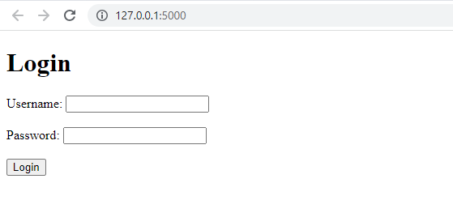
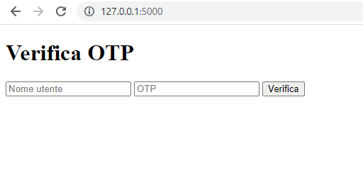
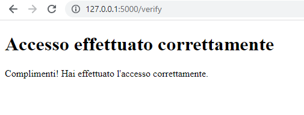

# Login a 2 fattori di autenticazione
Il programma è un'applicazione web basata su Flask che implementa un sistema di autenticazione utilizzando username, password e una One-Time Password (OTP). 
L'obiettivo è verificare l'identità dell'utente richiedendo username e password, inviare un codice OTP all'indirizzo email specificato e successivamente verificare anche il codice OTP inserito dall'utente per 
concedere l'accesso.

## Funzionalità

L'utente accede alla pagina principale dell'applicazione. Qui viene presentato un modulo di accesso che richiede l'username e la password.

L'utente inserisce l'username e la password e invia il modulo. Il server Flask verifica se l'username e la password corrispondono alle credenziali memorizzate (nel caso di esempio, l'username è "[nostronome@gmail.com]" 
e la password è "1234"). Se le credenziali sono corrette, viene generato un codice OTP casuale.
Il server Flask invia il codice OTP all'indirizzo email specificato. 
Questo viene fatto utilizzando la funzione send_otp_email() che utilizza la libreria smtplib per inviare l'email tramite un server SMTP configurato.
L'utente viene reindirizzato alla pagina di verifica dell'OTP. Qui viene richiesto di inserire l'OTP ricevuto via email insieme al proprio username.

L'utente inserisce l'OTP e l'username e invia il modulo. Il server Flask recupera l'OTP memorizzato per l'utente specificato utilizzando la funzione get_stored_otp().
Il server Flask verifica se l'OTP inserito dall'utente corrisponde all'OTP memorizzato. Se corrispondono, viene visualizzata una pagina di conferma con il messaggio "Accesso effettuato correttamente". 
In caso contrario, viene visualizzato un messaggio di errore.

## Installazione
Assicurati di avere Python installato sul tuo sistema. Puoi scaricare l'ultima versione di Python dal sito ufficiale: https://www.python.org/downloads/

Crea una nuova directory per il tuo progetto Flask.

Apri un terminale o una finestra del prompt dei comandi e naviga nella directory del tuo progetto.

Crea un ambiente virtuale per il tuo progetto. Puoi farlo eseguendo il seguente comando: python -m venv venv

Attiva l'ambiente virtuale. Il comando varia a seconda del sistema operativo:
Su Windows:         venv\Scripts\activate
Su MacOS e Linux:   source venv/bin/activate

Ora installa Flask eseguendo il seguente comando: pip install Flask

Crea un file chiamato app.py nella directory del tuo progetto e copia il codice sorgente dell'applicazione Flask in questo file.

Crea una directory chiamata templates nella directory del tuo progetto. All'interno di questa directory, crea il file verify_otp.html e copia il codice HTML del template all'interno di esso.

Ora puoi avviare l'applicazione Flask eseguendo il seguente comando: flask run

L'applicazione Flask verrà avviata e ti fornirà l'URL a cui puoi accedere nell'ambiente locale. Di solito sarà qualcosa del tipo http://127.0.0.1:5000/.

Ora dovresti essere in grado di accedere all'applicazione Flask dal tuo browser utilizzando l'URL fornito. Segui le istruzioni sulle pagine per testare l'autenticazione con username, password e OTP.

Ricorda che questa è solo una spiegazione generale dei passaggi di installazione. Potrebbero essere necessari ulteriori passaggi o configurazioni a seconda delle tue specifiche esigenze e dell'ambiente in cui stai lavorando.

